For documentation, put the date, then what you are documenting

2/3/25

-   Researching and setting up the servers and how they work. We are
    currently trying to play around with the servers and use single user
    boot mode to have our own

-   environment to play in

-   Got a draft proposal done

-   **Boot with "init=/bin/sh"**

1\. **Reboot and Access GRUB Menu**

-   Press **Esc** or **Shift** repeatedly during boot until you see the
    **GRUB** menu.

2\. **Edit the Kernel Parameters**

-   Select the **Proxmox VE kernel** entry and press **e** to edit.

3\. **Change the Kernel Line**

-   Locate the line starting with: linux /boot/vmlinuz-\...

<!-- -->

-   Replace ro quiet with: rw init=/bin/sh

4\. **Boot with Ctrl + X or F10**

5\. **Reset Root Password**

-   passwd root

6\. **Reboot Normally**

-   exec /sbin/init

<!-- -->

-   [PASSWORD]{.mark} was reset to [CSCI399]{.mark}

-   Was able to login to the server with:

    -   [USER: root]{.mark}

    -   [PASSWORD: CSCI399]{.mark}

-   Today we failed to connect to the internet for the server. We tried
    to connect via ethernet to the wall, then with a wifi receiver, then
    to my mac but nothing worked.

2/5/25

-   Had to windows + r , go to admin settings ncpa.cpl. Brings up
    network connections.

-   Brings up ethernet, right click, properties, ipv4, set IP's as
    follows

-   IP: 10.0.0.14

-   Subnet: 255.255.255.0

-   Gateway: 10.0.0.1

-   DNS: google - 8.8.8.8

Accessed the Hypervisor webpage using
[[https://10.0.0.14:8006]{.underline}](https://10.0.0.14:8006)

-   Using login credentials as above for root

After identifying the current system, we need to look up how to wipe and
upload VMware 8 to the hypervisor as this is going to be our preferred
system.

2/10/25

-   Installed the ISO file for VMware vSphere 8 Grant Banta gave us to a
    Flash Drive

-   Plug the Flash Drive into the Dell Server

-   Changed the BIOS setting on the Server to boot from the Flash Drive

-   Attempted to load the Flash drive with the vSphere image on the back
    of the hypervisor, not able to successfully boot.

-   Properly downloaded RUFUS and used it to format the .ISO on to a
    Flash Drive and booted the Hypervisor using the .ISO file.

-   New root password changed to CSCI499!

-   Have to access the DHCP website via:

-   https://169.254.152.194/

2/12/25

-   When booted up server, ESXi didn't boot. Possibly because we didn't
    install ESXi on the Hard Disks, we ran ESXi off of the flash drive

-   When we tried to install ESXi on the Hard Disks we couldn't see the
    disks for some reason

-   Hypervisor didn't boot up, possibly couldn't access RAID storage to
    configure correctly

-   Go through the boot load again and boot from flash, edit setting on
    ESXi to allow for shell and SSH(ENABLE both). Reboot.

-   Access BIOS and find RAID storage, pressing f2 when rebooting and
    navigating to the RAID portion. RAIDS storage was there but was
    under foreign setting, cleared setting and rebooted.

-   Hard Drives did not show up again when trying to install ESXi to
    Server. Went back to the RAID storage in the BIOS and created a
    Virtual Disk with RAID 0 for each Hard Drive. They are online.
    Reboot.

-   Logged into the DHCP website and saw the 3 4TB disks

2/17/25

-   Booted up ESXi from the flash drive

-   Tried to connect to ESXi website via DHCP, but no luck

-   Changed the ESXi network configuration settings to have a static ip

-   Tried to connect to ESXi website via static ip, but had no luck

-   We were trying to connect the ethernet cable with an ethernet to
    USB-C adapter to our computers and we were not able to connect to
    ESXi website. We tried connecting the ethernet directly without
    using an adapter to the professor laptop and we were able to connect
    to the website.

2/19/25

-   Had to delete the install on the usb drive and reinstall it.

-   The problem was that when we initialized the installer of the ESXi,
    the RAIDs were not configured, and not able to be selected. So
    initially we booted from the usb and it kept on booting from there
    as it was selected for the full installation.

-   Successfully installed it to the hdd

-   Assigned the license, created a new instance of a windows 11 VM

-   Ran into a problem

    -   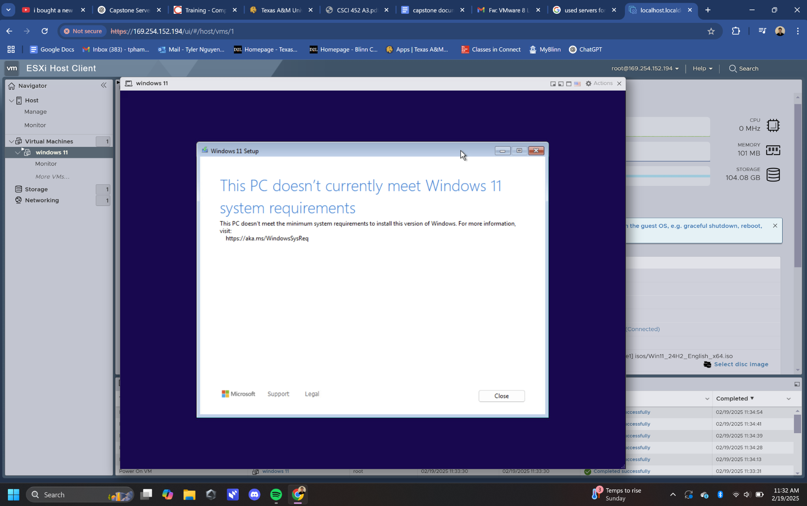{width="4.609375546806649in"
        height="2.8956332020997375in"}

-   Shift + f10 to go into terminal

    -   Regedit

    -   HKEY_LOCAL_MACHINE \> SYSTEM \> SETUP

    -   Right click setup \> new, then created a new file called
        LabConfig

    -   Created 5 new q keys

    -   BypassTPMCheck → Set value to 1

    -   BypassSecureBootCheck → Set value to 1

    -   BypassRAMCheck → Set value to 1

    -   BypassStorageCheck → Set value to 1

    -   BypassCPUCheck → Set value to 1

    -   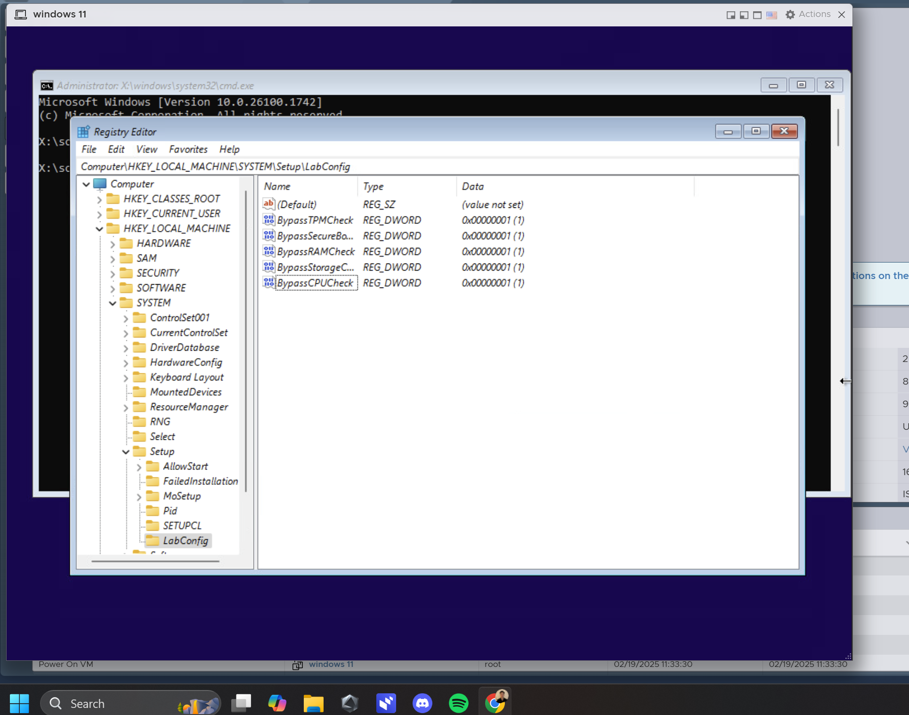{width="4.911458880139983in"
        height="3.8738265529308835in"}

    -   Restart

    -   Did Not work

2/24/2025

-   Shift + f10 to go into terminal

    -   Regedit

    -   HKEY_LOCAL_MACHINE \> SYSTEM \> SETUP

    -   Right click setup \> new, then created a new file called
        LabConfig

    -   Created 2 new dword files

    -   BypassTPMCheck → Set value to 1

    -   BypassSecureBoot → Set value to 1

-   Setting up windows

    -   Ran into network issue requiring me to connect to internet

    -   Could not install a driver for the internet. Must install
        windows to install vmware tools for the internet driver

    -   To bypass the check, shift + f10 into terminal and ran

        -   OOBE\\BYPASSNRO

-   Security questions

    -   First pet's name: joe

    -   City where you were born: bryan

    -   Childhood nickname: joe

-   Up and running

-   Next day, need to get connected to internet

2/26/25

-   Gave presentation on
    [[https://www.slideshare.net/slideshow/vsicm8m02pptx/258007473]{.underline}](https://www.slideshare.net/slideshow/vsicm8m02pptx/258007473)

-   Showed hands display on vSphere 8, datastore1 and windows 11vm.

-   Discussed lab ideas:

    -   SIEM labs

    -   Malware database, or sandbox.

-   \*\*\*\*\*\*\*\*\*\*\*\*\*\*\*\*\*\*\*\*\*\*\*\*Research PROJECT
    IDEAS\*\*\*\*\*\*\*\*\*\*\*\*\*\*\*\*\*\*\*\*\*

-   Send email about project idea.

3/3/2025

-   Today we are going to install security onion

-   Downloaded the iso at
    [[https://github.com/Security-Onion-Solutions/securityonion/blob/2.4/main/DOWNLOAD_AND_VERIFY_ISO.md]{.underline}](https://github.com/Security-Onion-Solutions/securityonion/blob/2.4/main/DOWNLOAD_AND_VERIFY_ISO.md)

-   Documentation:
    https://docs.securityonion.net/en/2.4/first-time-users.html

-   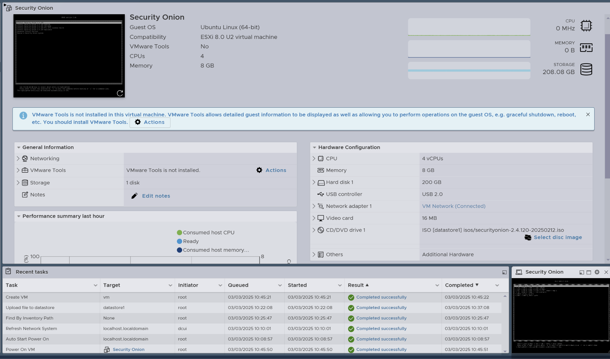{width="6.515625546806649in"
    height="3.842548118985127in"}

-   Specs above

-   [LOGIN FOR SECURITY ONION SIEM VM:]{.mark}

    -   [User: root399]{.mark}

    -   [Pass: CSCI399!]{.mark}

-   Proceeding to installing security onion

-   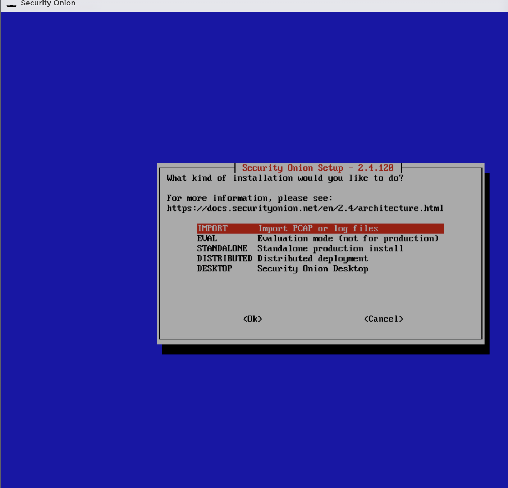{width="3.4427088801399823in"
    height="3.320547900262467in"}

-   Chose standalone

-   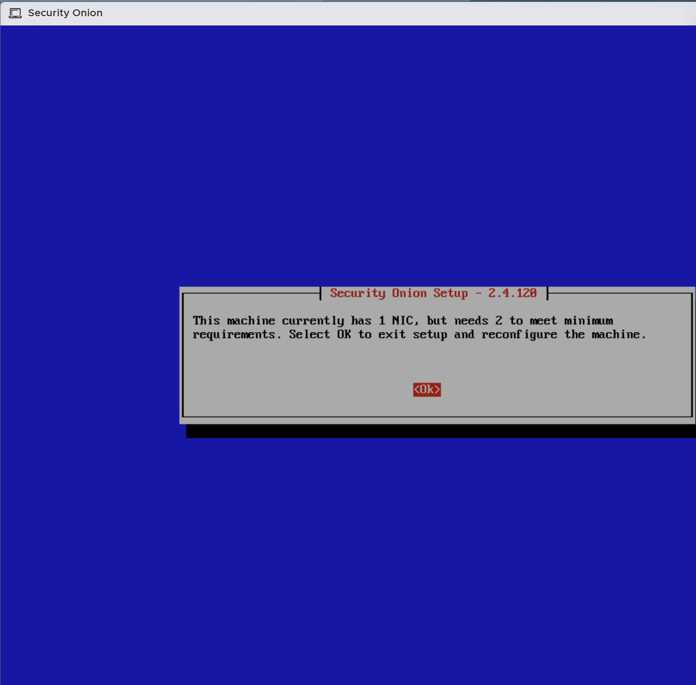{width="4.137805118110236in"
    height="4.078125546806649in"}

-   Have to add another network adapter. One is for the management
    interface (for web access, administration, updates). The other is
    for the monitoring interface (to capture and analyze network
    traffic)

-   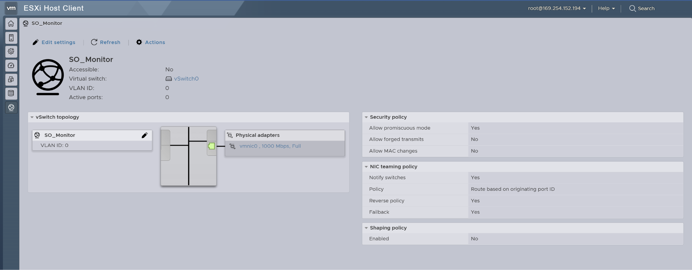{width="6.5in"
    height="2.5416666666666665in"}

-   Add new port group

-   Had to reconfigure memory from 8 to 16 gb

-   Hostname: root399

-   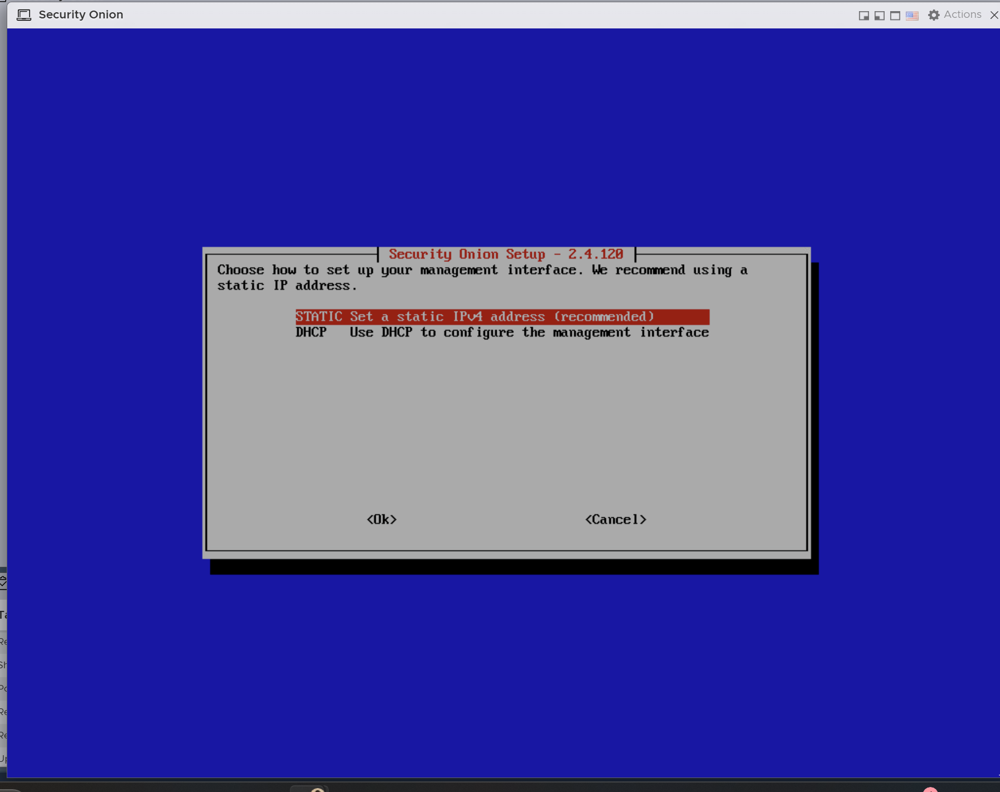{width="5.432123797025372in"
    height="4.309136045494313in"}

-   Chose static

-   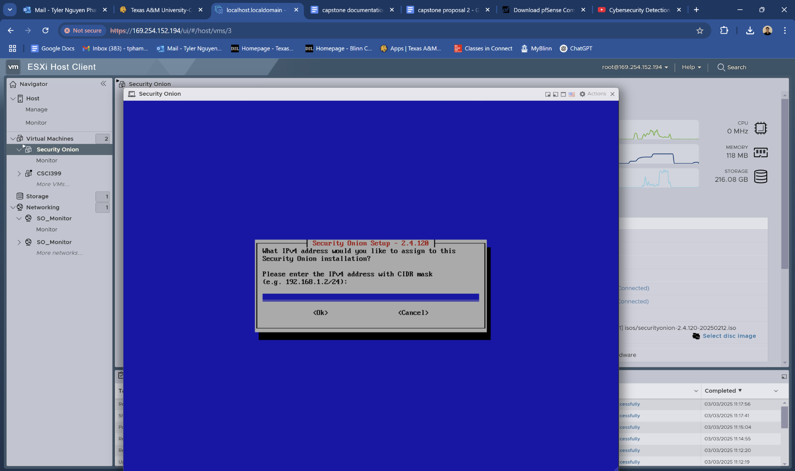{width="6.105795056867891in"
    height="3.6302088801399823in"}

-   searchdomain.local

-   

-   Assigned a static IP address for the ESXi server to be able to
    properly configure the Onion Server with IP address also. New IP:
    192.168.1.100

-   Had to configure ipv4 setting for ethernet on user's computer to be
    able to connect to the client

03/05/2025

-   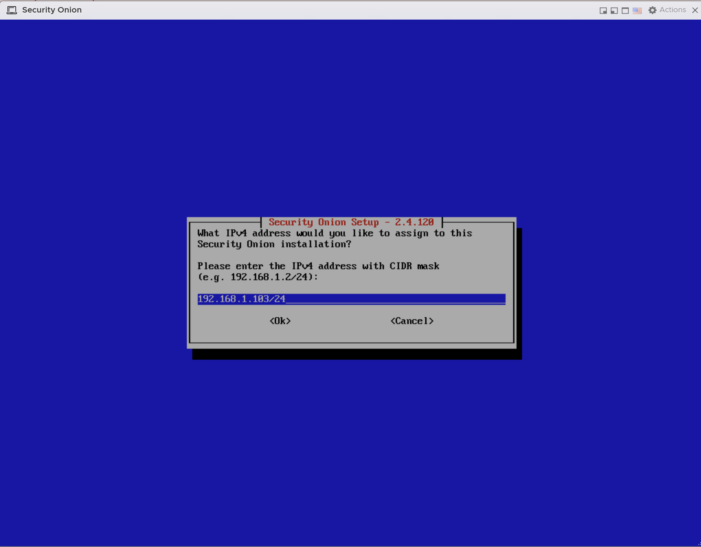{width="5.707479221347332in"
    height="4.463542213473316in"}

-   Gateway ipv4: 192.168.1.100

-   Chose direct connection to the internet

-   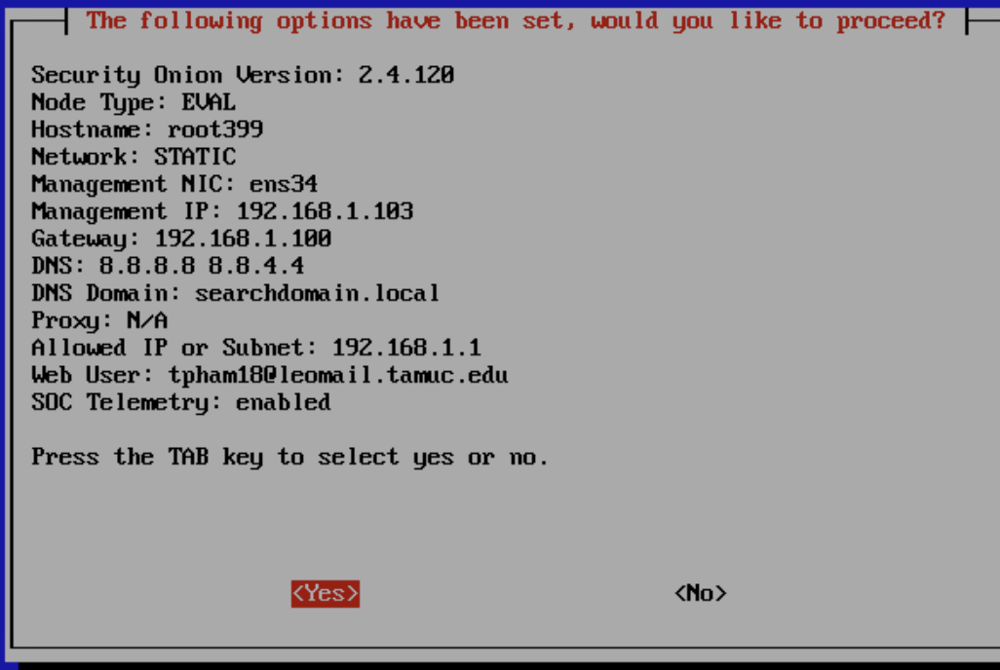{width="6.5in"
    height="4.361111111111111in"}

-   Ok, it couldn\'t connect to the internet. To make it simpler we are
    just going to install the eval version of security onion instead of
    the standalone. Standalone has more features but is more complicated
    to setup. We are just going to get used to security onion and switch
    to the standalone version once we are confident enough

-   Seems like we have to be connected to the internet to be able to
    fully access Security Onion. We are getting timeout errors.

3/19/25

-   Grant and brian came in on Monday and revamped our project and are
    now guiding us.

-   Today Grant came in and is installing the physical cisco firewall
    into the server rack for us

-   I am currently creating a Kali Linux VM

    -   User: kali

    -   Pass: kali

-   Below is a **rough rough** draft of our new architecture created by
    Grant for us.

    -   ESXI houses the VMs, which we will run through the
        Firewall(hardware provided by Grant). This will allow us to view
        the network flow when using Kali Linux to attack our vulnerable
        machine.

-   Switch [[http://192.168.1.254]{.underline}](http://192.168.1.254)

    -   Password: password!

-   Firewall [[http://192.168.1.1]{.underline}](http://192.168.1.1)

    -   Login: admin

    -   Password: password

-   The Switch will be split into different Vlans, 1, 20, 30. More can
    be added as needed.

-   

-   \*\*\*Need to Login to the switch -\> http://192.168.1.254 login
    page, and get the backup file documentation\*\*\*\*

    -   Vlan 1 - Maintenance

        -   Switch: 192.168.1.254

        -   Gateway: 192.168.1.1 /24

    -   Vlan 20 - Good

        -   Switch: 192.168.2.254

        -   Gateway: 192.168.2.1 /24

    -   Vlan 30 - Bad

        -   Switch: 192.168.3.254

        -   Gateway: 192.168.3.1 /24

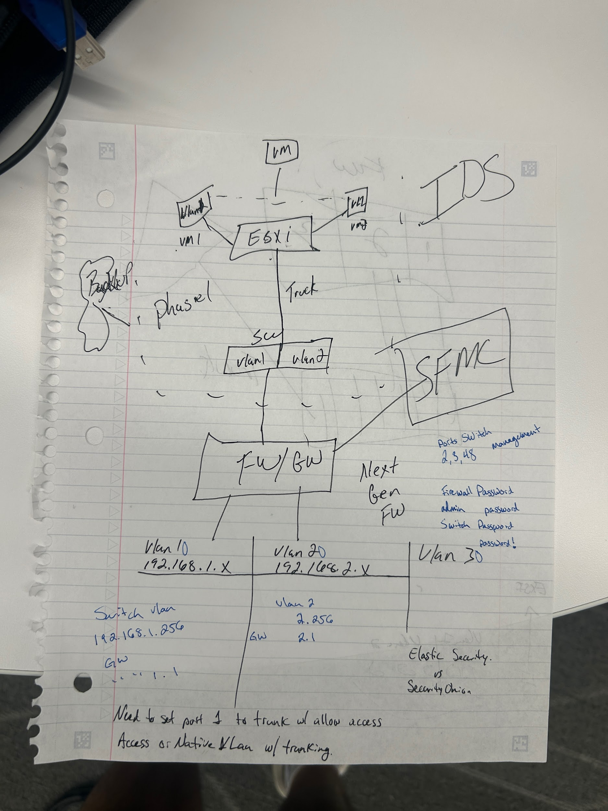{width="3.5256091426071743in"
height="4.732706692913386in"}
